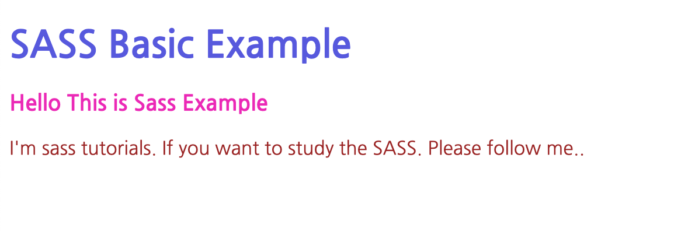

# SASS 소개. 

SASS 는 Systematically Awesome Style Sheets 의 줄임말로, CSS pre-processor 입니다. 

CSS pre-process 의 역할은 결국 css 를 생성하는 툴이라는 것입니다. 

sass의 사용 이유는, 큰 프로젝트에서나, 하나의 기본 스타일 가이드를 작성해두고, 다양한 variation 을 주어 HTML style 에 변화를 주고자 할 때 매우 유용한 툴입니다. 

## 처리방식

sass or scss 코드 작성 --> compile --> css 파일 생성 

위와 같은 순서로 처리가 됩니다. 

## SASS 이용 장점

- CSS를 작성할 때 보다, SASS 를 이용하면, 간단하게 코드를 작성할 수 있습니다. 
- CSS를 빠르게 작성하기 위해서 훨씬 작은 코드만을 작성하면 됩니다. 
- CSS 의 활장이기 때문에 더 강력하고, 우아하게 코드를 작성할 수 있습니다. 
- 모든 CSS 버젼과 호환됩니다. 또한 CSS 라이브러리를 그대로 이용할 수 있습니다. 
- 중첩된 css 를 작성할 수 있고, 변수, 함수, 다양한 내장 오퍼레이션등을 이용할 수 있습니다. 

## SASS, SCSS 차이점. 

SASS 는 2가지 작성 방식을 가집니다. 

- SASS: Ruby 형태의 개발 신택스를 이용합니다. sass는 인덴트를 이용하여 statement 계층을 구분하고, 변수를 지정할때 !를 이용합니다. 

```sass
!main-color=#eee;

.colored-text
    color=!main-color
    font-size=1.2rem
```

- SCSS: css 와 매우 유사하게 작업할 수 있습니다. 그리고 Sassy CSS 라고 부릅니다. 

```sass
$main-color:#eee;

.colored-text {
    color: $main-color;
    font-size:1.2rem
}
```

참고: 일반적으로 SASS 보다는 SCSS 를 더 많이 사용하는 측면이 있습니다. 아무래도 SCSS 가 CSS 에서 기능을 더 확장한 형태로 개발을 수행할 수 있기 때문인것 같습니다. 

## SASS 설치하기. 

SASS 를 설치하기 위한 다양한 방법이 있습니다. 

### ruby gem 을 이용한 설치. 

설치하기. 

```
gem install sass
```

### node 이용하여 sass 설치하기. 

```
npm install -g sass
```

### brew 을 이용하여 sass 설치하기. 

```
brew install sass/sass/sass
```

### SASS 이용하기. 

sass 컴파일 하기. 

```
sass input.scss output.css
```

변경사항 발생시 마다 컴파일하기. 

```
sass --watch input.scss:output.css

or 

sass --watch app/sass:dist/css
```

## 기본 샘플 작성하기. 

이번에는 기본 샘플을 작성해 보겠습니다. 

```
mkdir basic
cd basic
```

위 디렉토리를 만들고 index.html 파일과 style.scss 파일을 각각 만들어 줍니다. 

### index.html 파일 작성하기. 

```html
<!DOCTYPE html>
<html lang="en">
<head>
    <meta charset="UTF-8">
    <meta name="viewport" content="width=device-width, initial-scale=1.0">
    <title>Basic SASS</title>
    <link rel="stylesheet" href="style.css">
</head>
<body>
    <h1>SASS Basic Example</h1>
    <h3>Hello This is Sass Example</h3>
    <p>I'm sass tutorials. If you want to study the SASS. Please follow me..</p>
</body>
</html>
```

위와 같이 HTML 코드를 작성합니다. 

우리는 h1, h3, p 엘리먼트에 스타일을 적용할 예정입니다. 

### scss 작성하기. 

이번에는 scss 를 작성하겠습니다. style.scss 파일을 생성합니다. 

```sass
$h1-color: rgba(70, 70, 221, 0.863);
$h3-color: rgb(238, 47, 190);
$p-color: brown;

h1 {
    color: $h1-color;
}

h3 {
    color: $h3-color;
}

p {
    color: $p-color;
}
```

위 코드를 보면 색상 변수 $h1-color, $h3-color, $p-color 을 각각 설정했습니다. 

그리고 h1, h3, p 에 대해서는 일반적인 css 스타일을 적용했습니다. 

### 컴파일하기. 

터미널을 열고, 다음과 같이 명령어를 실행합니다. 

```
sass style.scss style.css
```

### 생성돤 css 파일 살펴보기. 

```
h1 {
  color: rgba(70, 70, 221, 0.863);
}

h3 {
  color: #ee2fbe;
}

p {
  color: brown;
}

/*# sourceMappingURL=style.css.map */

```

생성된 코드를 보면 설정한 색상 값이 각 css 스타일에 적용된 것을 확인할 수 있습니다. 

### 결과보기 

index.html 을 브라우저에서 열어 줍니다. 



보시는 바와 같이 변경된 것을 확인할 수 있습니다. 

## 결론

지금까지 SASS 를 살펴 보았습니다. 

CSS 와 동일한 코드로 작성할 수 있으며, 변수까지 설정하여 이용하는 것을 보았습니다. 

컴파일을 통해서 생성된 css 코드도 확인해 보았습니다. 

SASS 를 조금씩 더 배울수록 매력에 쏙 빠질것 같습니다. 


