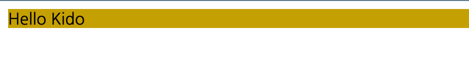
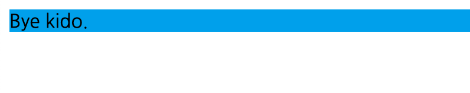
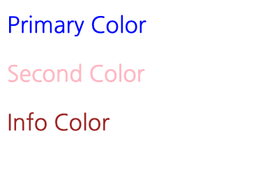
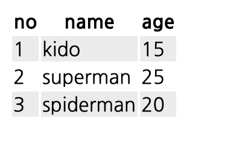
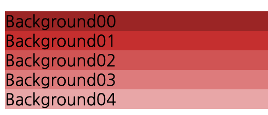

# 구문 컨트롤하기. 

이번에는 sass 에서 제공하는 다양한 컨트롤 방법을 알아 보겠습니다. 

보통 특정 조건에 따라 원하는 일을 수행하기 위해서 if 구문을 이용하기도 합니다. 

혹은 반복을 통해서 동일한 작업을 반복 하기도 합니다. 

## if 를 이용하여 조건별 작업 수행하기. 

if 를 이용하기 위해서 @if 구문을 사용합니다. 그리고 특정 조건에 만족하지 않을때 @else 를 이용하거나 혹은 다른 조건을 이용하고자 할 때 @else if 를 이용할 수 있습니다 .

```sass
$name: 'hello';
$color: #eee;
$hello: none;
$bye: none;
$background: '';

@if $name == 'hello' {
    $hello: block;
    $background: #ccaa00;
    $bye: none;
}
@else {
    $hello: none;
    $background: #00aaee;
    $bye: block;
}

div.hello-box {
    display: $hello;
    background: $background;
}

div.bye-box {
    display: $bye;
    background: $background;
}
```

위 내용과 같이 @if 와 @else 를 이용하여 $name 의 변수값에 따라서 hello 인경우, hello-box 가 보이고, bye-box 는 보이지 않게 설정했습니다. 

만약 $name 값을 hello 가 아닌 다른 값으로 바꾸면, bye-box 가 보이고, hello-box 는 나타나지 않습니다. 

html 을 아래와 같이 작업합니다. 

```html
<!DOCTYPE html>
<html lang="en">
<head>
    <meta charset="UTF-8">
    <meta name="viewport" content="width=device-width, initial-scale=1.0">
    <title>Controller</title>
    <link rel="stylesheet" href="../../dist/css/04.control/control.css">
</head>
<body>
    <div class="hello-box">
        Hello Kido
    </div>
    <div class="bye-box">
        Bye kido.
    </div>
</body>
</html>
```

결과를 확인해 보겠습니다. 

$name 가 hello 인경우. 



$name 가 bye 로 지정된경우 



## each 이용하기. 

@each 를 이용하면 특정 범위의 값을 반복할 수 있습니다. 

예를 들어 폰트 색상을 3가지로 primary, secondary, info 를 가지고 있고, class 에 primary, secondary, info 에 따라서 폰트 색상을 다르게 노출한다고 해 봅시다. 

control.scss

```sass
// each
$colorset: ('primary':blue, 'second':pink, 'info':brown);

@each $name, $color-val in $colorset {
    .font-#{$name} {
        color: $color-val;
    }
}
```

위와 같이 지정하면 클래스로 font-primary, font-secondary, font-info 등의 값이 지정되면, 글자 색상이 파랑, 핑크, 브라운 색상으로 노출됩니다. 

index.html

```html
    <div>
        <p class='font-primary'>Primary Color</p>
        <p class='font-second'>Second Color</p>
        <p class='font-info'>Info Color</p>
    </div>
```

위와 같이 html 을 만들고. 클래스 지정한 결과가 어떻게 되었는지 확인해 보겠습니다. 




## for 구문 이용하기. 

for 도 each 와 동일하게 반복처리를 수행합니다. 

for는 시작, 종료 값을 지정하고, 해당 인덱스를 반복하는 처리를 수행합니다. 

```sass
// for
$table-bg-color: #eee;

@for $i from 1 to 4 {
    @if ($i % 2) == 0 {
        tr:nth-child(2n + #{$i}) {
            background-color: $table-bg-color;
        }
    }
    
}
```

위처럼 하면 1 에서 4까지 반복 합니다. 이때 from 은 시작값, to는 종료값입니다. 

to 는 종료값을 포함하지 않습니다. 그러므로 1, 2, 3 까지 반복합니다 .

through 를 이용하면 종료값을 포함합니다. 그러므로 1, 2, 3, 4 까지 반복합니다.

html 코드를 다음과 같이 작성합니다. 

```html
    <table>
        <tr>
            <th>no</th>
            <th>name</th>
            <th>age</th>
        </tr>
        <tr>
            <td>1</td>
            <td>kido</td>
            <td>15</td>
        </tr>
        <tr>
            <td>2</td>
            <td>superman</td>
            <td>25</td>
        </tr>
        <tr>
            <td>3</td>
            <td>spiderman</td>
            <td>20</td>
        </tr>
    </table>
```

결과를 확인해 보겠습니다. 



## while 이용하기. 

while 도 동일하게 반복을 수행합니다. 

다음 예제는 그라데이션된 div 배경색을 그려보겠습니다. 

```sass
// while
$to: 5;
$loop-value:0;

@while $loop-value < $to {
    .grad-background-#{$loop-value} {
        background-color: lighten(brown, $loop-value * 10%);
    }
    $loop-value: $loop-value + 1

}
```

보시는바와 같이 $loop-value 는 0부터 시작하며, 이 값이 5가 되기 전까지 반봅 합니다. 

클래스를 grad-background-0, grad-background-1 ... grad-background-4 까지 배경색상을 갈색에서 옅은 갈색으로 총 5단계를 만들어 줍니다. 

생성된 css 는 다음과 같습니다. 

```css
.grad-background-0 {
  background-color: brown;
}

.grad-background-1 {
  background-color: #cc3636;
}

.grad-background-2 {
  background-color: #d65f5f;
}

.grad-background-3 {
  background-color: #e18787;
}

.grad-background-4 {
  background-color: #ebb0b0;
}
```

이제 html 을 다음과 같이 작성합니다. 

```html
    <div class="grad-background-0">Background00</div>
    <div class="grad-background-1">Background01</div>
    <div class="grad-background-2">Background02</div>
    <div class="grad-background-3">Background03</div>
    <div class="grad-background-4">Background04</div>
```

이렇게 하고 나서 결과를 확인해보면 다음과 같습니다. 



## 결론

지금까지 sass 를 활용한 구문 컨트롤에 대해서 알아 보았습니다. 

조건, 반복문등을 쉽게 구한할 수 있어서, 간단한 코드로 다양한 스타일을 생성해 낼 수 있게 되었습니다. 


