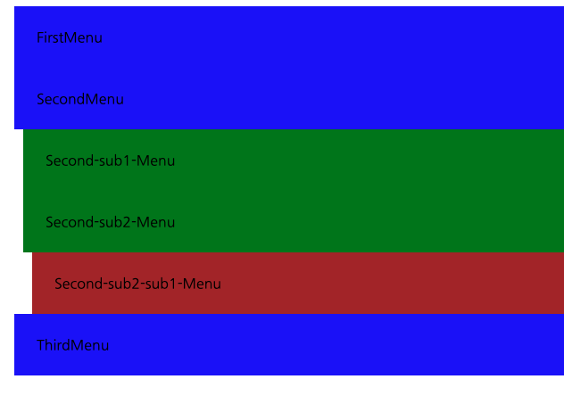

# @function 이용하기. 

sass 의 매력중에 하나는 여느 프로그래밍 언어와 같이, function 을 이용할 수 있다는 것입니다. 

function 을 생성하고, 특정 위치에서 이 함수를 실행하면, sass 는 컴파일할때 해당 함수를 호출하여 다양한 결과값을 반환할 수 있습니다. 

## @function 이용

### function 기본 

function 을 만드는 방법은 @function 룰을 이용하는 것이빈다. 

```sass

$margin-increase: 10;

@function indent($level) {
    @return $level * $margin-increase * 1px;
}

@for $var from 1 through 3 {
    .indent-#{$var} {
        margin-left: indent($var);
    }
}

```

결과로 생성된 css 코드를 확인하면 다음과 같습니다. 

```css
.indent-1 {
  margin-left: 10px;
}

.indent-2 {
  margin-left: 20px;
}

.indent-3 {
  margin-left: 30px;
}

/*# sourceMappingURL=function.css.map */

```

이미 이전에 배운바와 같이 css style 가 3개가 생성이 되었습니다. 

결과를 확인해보겠습니다. 


### function 으로 색상 표현하기. 

이번에는 함수를 하나 더 만들어서 색상을 다르게 지정해 보겠습니다. 

```sass

$margin-increase: 10;
$backgrounds:( blue, green, brown );

@function indent($level) {
    @return $level * $margin-increase * 1px;
}

@function colors($index, $backgrounds) {
    @return nth($backgrounds, $index);
}

@for $var from 1 through 3 {
    .indent-#{$var} {
        margin-left: indent($var);
        background-color: colors($var, $backgrounds);
    }
}
```

인덱스에 따라 색상을 가져오는 function 을 만들었고, 반복을 통해서 인덱스에 따른 색상을 가져왔습니다. 

sass 에서는 인덱스는 1부터 시작합니다. 

생성된 css 는 다음과 같습니다. 

```css
.indent-1 {
  margin-left: 10px;
  background-color: blue;
}

.indent-2 {
  margin-left: 20px;
  background-color: green;
}

.indent-3 {
  margin-left: 30px;
  background-color: brown;
}

/*# sourceMappingURL=function.css.map */

```

결과를 확인해 보겠습니다. 


### 가변적인 변수 받기. 

함수에서 가변적인 변수를 받을 수 있습니다. 

```sass

$margin-increase: 10;
$backgrounds:( blue, green, brown );

@function indent($level) {
    @return $level * $margin-increase * 1px;
}

@function colors($index, $backgrounds) {
    @return nth($backgrounds, $index);
}

@function sum($padding-vals...) {
    $sum: 0;
    @each $value in $padding-vals {
        $sum: ($sum + $value);
    }

    @return $sum;
}

@for $var from 1 through 3 {
    .indent-#{$var} {
        margin-left: indent($var);
        background-color: colors($var, $backgrounds);
        padding: sum(10px,15px);
    }
}


```

위와 같이 sum function 을 만들었습니다. 

그리고 파라미터를 $padding-vals... 을 통해서 가변 리스트를 받을 수 있도록 작업했습니다. 

결과를 확인해 보겠습니다. 




원하는 것 처럼 패딩이 되었네요. 

## 결론

sass 에서 function 을 활용하여 반복적인 작업을 몇가지 실험해 보았습니다. 

@function 을 이용하여, 컴파일 타임에 복수개의 스타일을 코드 반복없이 수행 할 수 있습니다. 